# LazyTerra

A terminal UI that brings simplicity to Terragrunt workflows. Navigate module trees. Run multi-module operations. Browse and modify state. View dependencies.

[](https://github.com/NikitaForGit/LazyTerra/actions)
[](https://github.com/NikitaForGit/LazyTerra/releases/latest)
[](LICENSE)
[](https://goreportcard.com/report/github.com/NikitaForGit/LazyTerra)


## Demo

### Dependencies Highlight
Navigate between modules to see their dependencies listed in the Dependencies pane.
Press `2` to focus the Dependencies pane and explore all dependencies of the selected module.
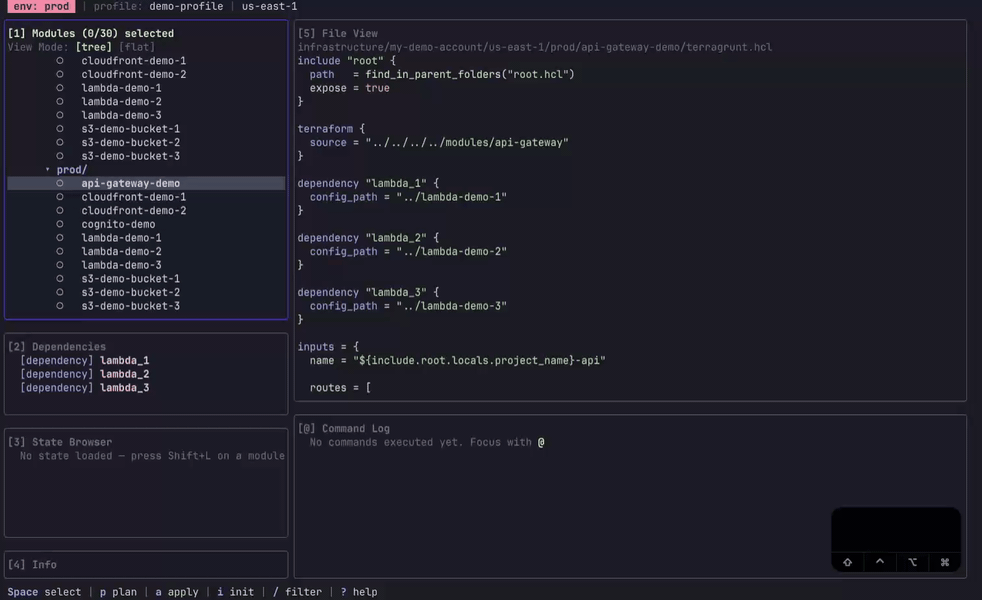

### Multi Module Apply
Select multiple modules with `Space`, then press `A` (Shift+a) to run apply-all on the selected modules (requires confirmation).
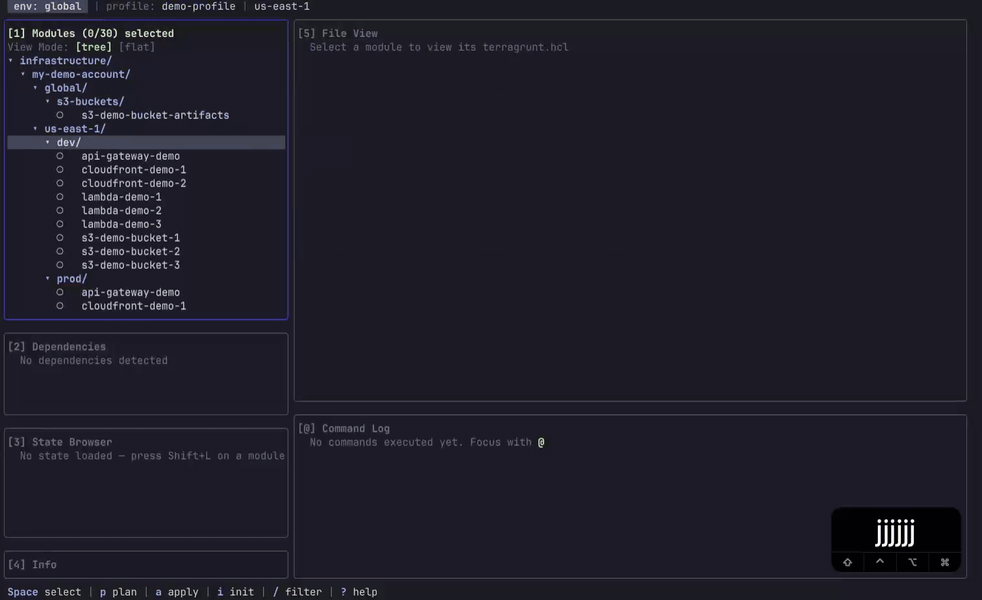

### Multi Module Destroy
Select multiple modules with `Space`, then press `D` (Shift+d) to run destroy-all on the selected modules (requires confirmation).


### State List
Press `L` (Shift+l) on a selected module to list all resources in the module's state.
Navigate the state browser to see all managed resources.
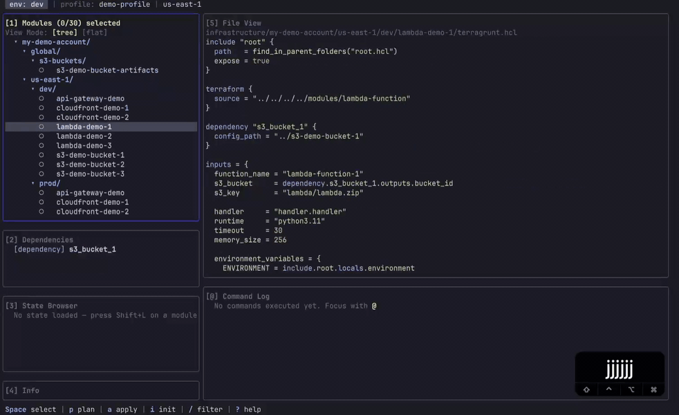

### State Show Resource
Press `s` on a selected resource in the state browser to show detailed information about that resource.
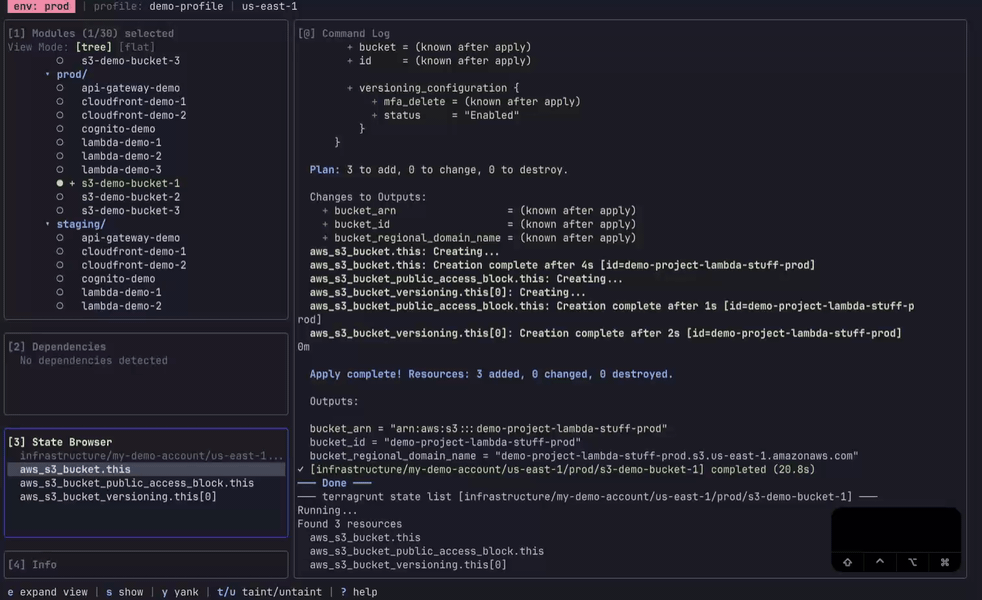

### Remove Resource from State
Press `D` (Shift+d) on a selected resource in the state browser to remove it from the state (requires confirmation).
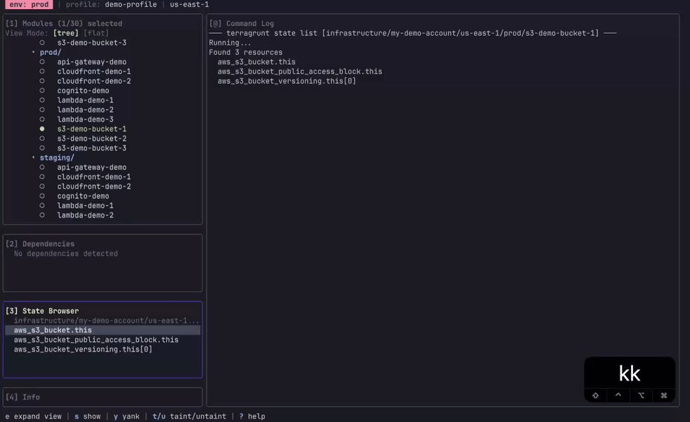

### Init Reconfigure
Press `I` (Shift+i) to run `terragrunt init --reconfigure` on a single module or multiple selected modules.
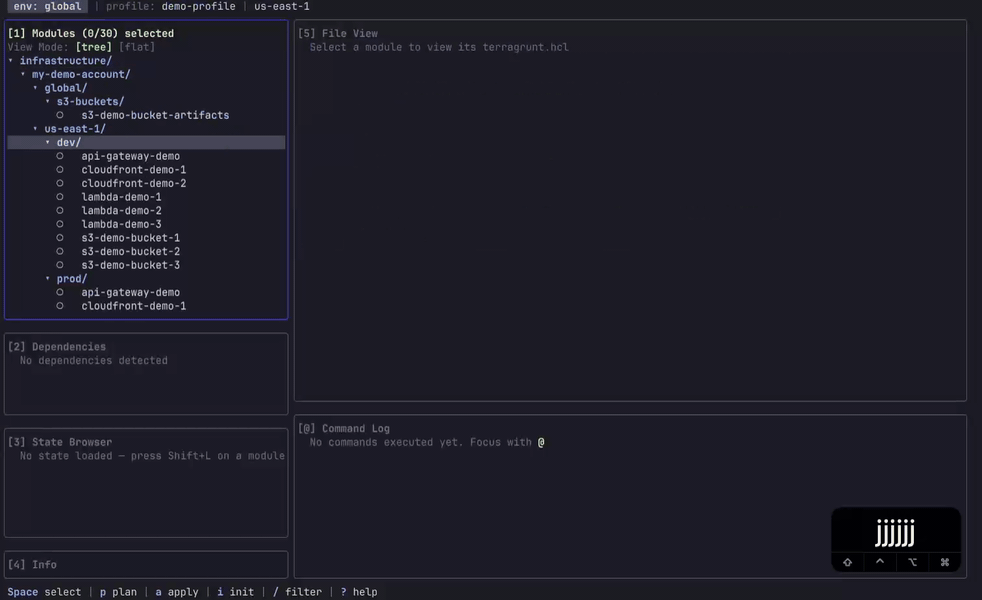

### Single Apply
Press `a` on a selected module to run the apply command (requires confirmation).
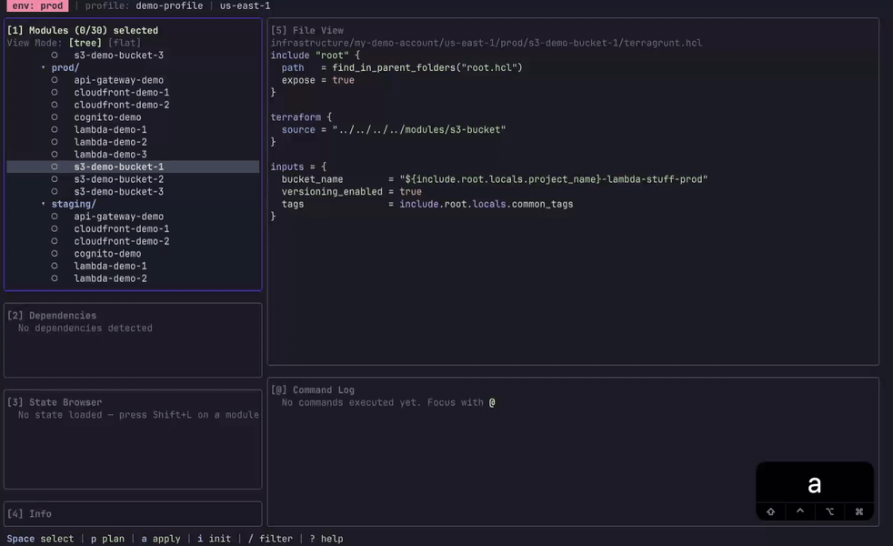

### Taint and Apply
Press `t` on a resource in the state browser to taint it.
Later, select the module and press `a` to apply and recreate the tainted resource.
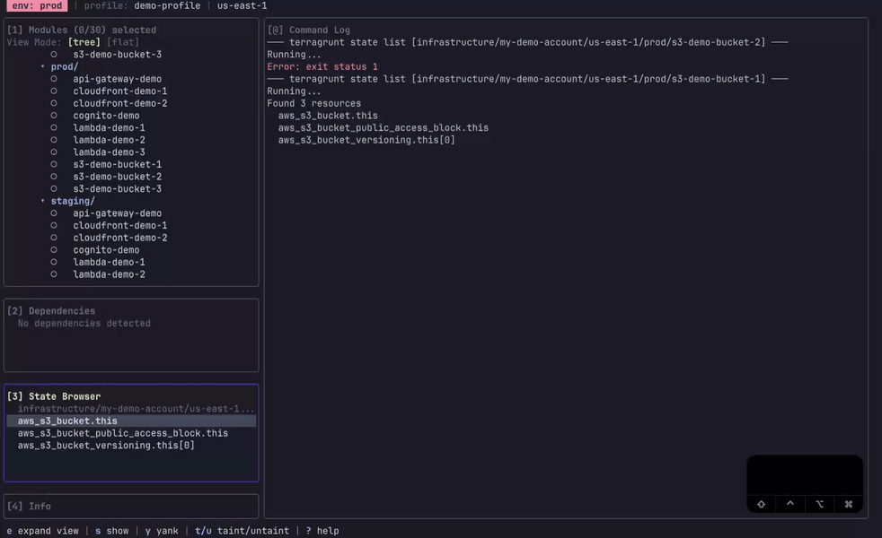

### HCL Format
Press `F` (Shift+f) to run `terragrunt hclfmt` on the selected module(s) to format your HCL files.
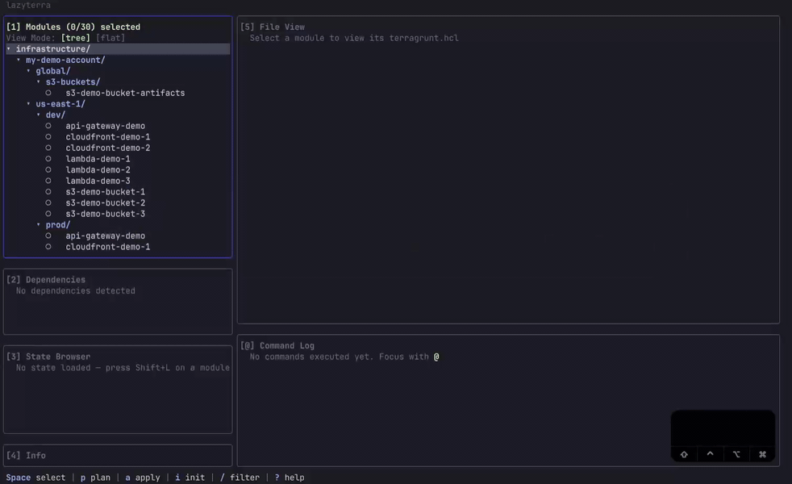

### Navigation and Environment Awareness
Notice that 'env' section on the top-left of the status bar is highlighted based on the environment path where the module is stored
prod = red
stg = yellow
dev/other = gray~blue


### Navigation
Use vim motions to navigate inside the panes (use `j/k`, `g/G`, `Ctrl+u/d`)
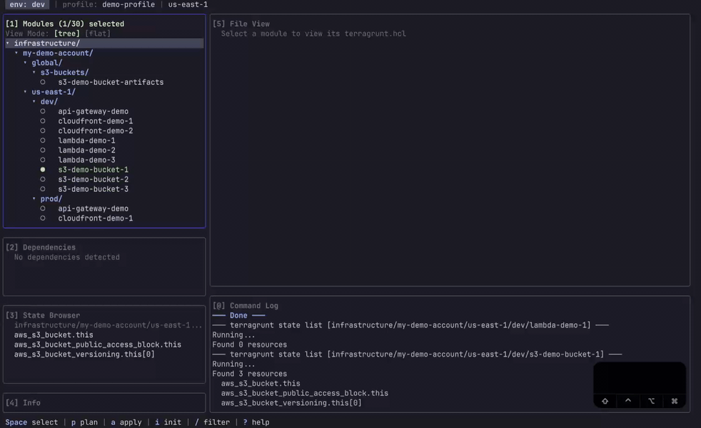

### Search Module
Press `/` to open fuzzy search and filter modules by path.
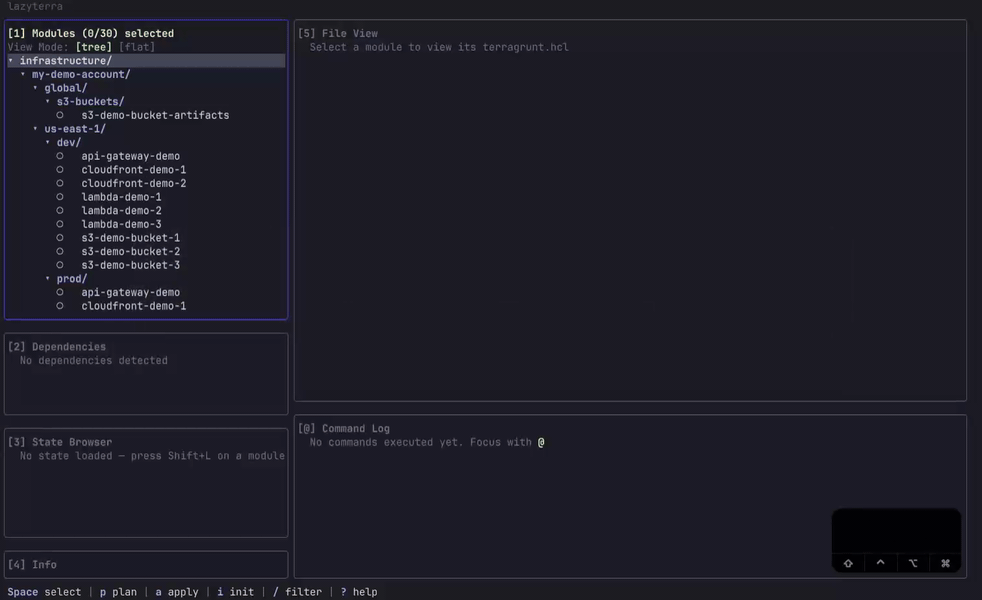

### Tree and Flat View
Press `1` to toggle between tree view and flat view of your modules.
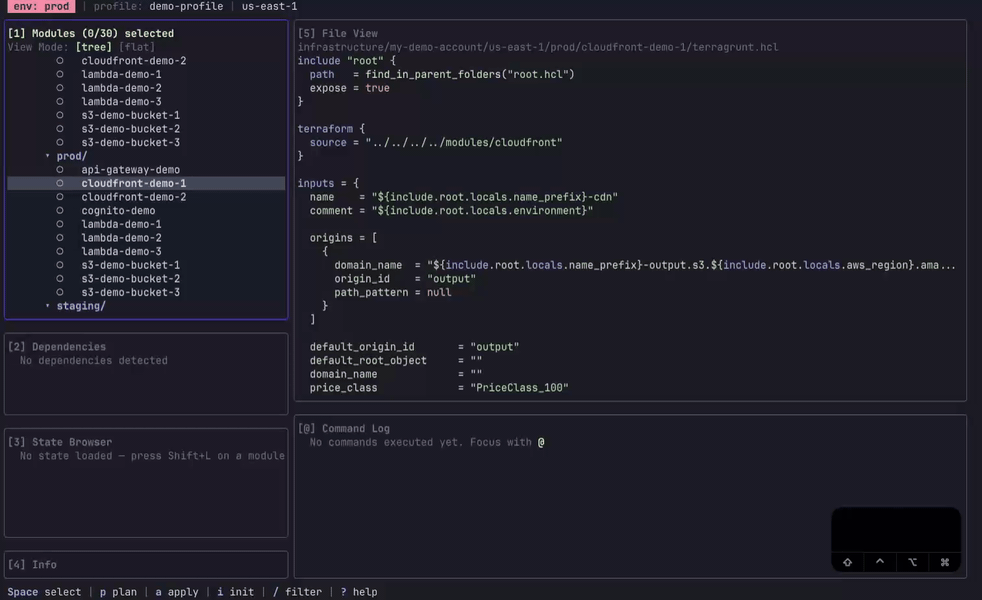

### Quick Edit
Press `e` to open the current module's `terragrunt.hcl` file in the editor that set as 'EDITOR' in local env (e.g `export EDITOR=nvim` will open the file in nvim (uses `vi` for editing as a fallback if 'EDITOR' is not set).
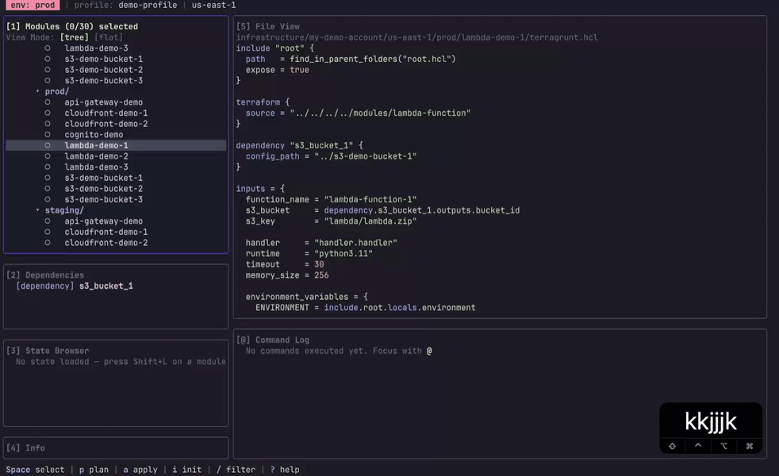

## Features

- **Module tree browser** — navigate your Terragrunt modules in a collapsible tree or flat view
- **Plan / Apply / Destroy** — run on a single module or across multiple with multi-select
- **State browser** — list, show, taint, untaint, replace, and remove state resources
- **Dependency viewer** — see dependencies and includes for any module
- **File viewer** — inspect `terragrunt.hcl` files with selection and yank support
- **Command log** — full scrollable output of every command
- **Identity detection** — reads AWS profile, region, and environment from your HCL config
- **Fuzzy search** — filter modules by path
- **TF_LOG picker** — change Terraform log verbosity on the fly
- **Editor integration** — open any module's `terragrunt.hcl` in `$EDITOR`

## Installation

### Homebrew (macOS and Linux)

```bash
brew install NikitaForGit/lazyterra/lazyterra
```

### Download binary

Grab the latest binary for your platform from [GitHub Releases](https://github.com/NikitaForGit/LazyTerra/releases), extract it, and move it somewhere on your PATH:

**macOS (Apple Silicon):**
```bash
tar -xzf lazyterra_*_darwin_arm64.tar.gz
sudo mv lazyterra /usr/local/bin/
```

**macOS (Intel):**
```bash
tar -xzf lazyterra_*_darwin_amd64.tar.gz
sudo mv lazyterra /usr/local/bin/
```

**Linux (amd64):**
```bash
tar -xzf lazyterra_*_linux_amd64.tar.gz
sudo mv lazyterra /usr/local/bin/
```

**Linux (arm64):**
```bash
tar -xzf lazyterra_*_linux_arm64.tar.gz
sudo mv lazyterra /usr/local/bin/
```

### Go install

Requires Go 1.24+.

```bash
go install github.com/NikitaForGit/LazyTerra/cmd/lazyterra@latest
```

> **Note:** This installs the binary to `$GOPATH/bin` (default `~/go/bin`).
> Make sure it's on your PATH:
>
> ```bash
> # zsh (macOS default)
> echo 'export PATH="$HOME/go/bin:$PATH"' >> ~/.zshrc && source ~/.zshrc
>
> # bash (most Linux distros)
> echo 'export PATH="$HOME/go/bin:$PATH"' >> ~/.bashrc && source ~/.bashrc
> ```

### Build from source

Requires Go 1.24+ and `make`.

```bash
git clone https://github.com/NikitaForGit/LazyTerra.git
cd LazyTerra
make install   # builds and installs to $GOPATH/bin
```

> Same PATH note as above applies — ensure `$GOPATH/bin` is on your PATH.

## Usage

Navigate to a directory that contains Terragrunt modules and run:

```bash
lazyterra
```

You can also pass a path:

```bash
lazyterra ./infra
```

Use `?` inside the TUI to open the context-sensitive help overlay at any time.

## Keybindings

### Global

| Key | Action |
|-----|--------|
| `Tab` / `Shift+Tab` | Cycle pane focus |
| `1` | Modules pane |
| `2` | Dependencies pane |
| `3` | State Browser pane |
| `4` | Info pane |
| `5` | File View pane |
| `@` | Command Log pane |
| `T` | TF_LOG level picker |
| `/` | Fuzzy search |
| `?` | Help overlay |
| `Ctrl+D` / `Ctrl+U` | Half-page down / up |
| `q` | Quit |
| `Q` | Kill running ops and quit |

### Modules

| Key | Action |
|-----|--------|
| `j` / `k` | Navigate down / up |
| `g` / `G` | Go to top / bottom |
| `h` | Collapse directory / go to parent |
| `l` | Expand directory |
| `Space` | Toggle multi-select |
| `p` | Plan (cursor module) |
| `P` | Plan-all (2+ selected) |
| `a` | Apply (single module, with confirmation) |
| `A` | Apply-all (2+ selected, with confirmation) |
| `d` | Destroy (single module, type-to-confirm) |
| `D` | Destroy-all (run-all, type environment name) |
| `i` | Init |
| `I` | Init --reconfigure |
| `v` | Validate |
| `o` | Show outputs |
| `r` | Refresh (re-plan) |
| `L` | State list (open state browser) |
| `e` | Open module `terragrunt.hcl` in `$EDITOR` |
| `E` | Open root `terragrunt.hcl` in `$EDITOR` |
| `y` | Copy relative path |
| `Y` | Copy absolute path |
| `c` | Clear selection (with confirmation) |
| `C` | Clear `.terragrunt-cache` (selected modules) |
| `U` | Force unlock (enter lock ID) |
| `F` | Run `terragrunt hclfmt` |
| `1` | Toggle tree / flat view |

### Dependencies

| Key | Action |
|-----|--------|
| `j` / `k` | Navigate down / up |
| `Ctrl+D` / `Ctrl+U` | Half-page down / up |
| `Enter` | Focus selected dependency block |

### State Browser

| Key | Action |
|-----|--------|
| `j` / `k` | Navigate down / up |
| `s` | Show resource details |
| `y` | Yank (copy) resource address |
| `t` | Taint resource |
| `u` | Untaint resource |
| `R` | Replace resource |
| `D` | Remove resource from state |
| `C` | Clear state view |
| `e` | Expand / collapse state browser |
| `r` | Refresh state list |

### File View

| Key | Action |
|-----|--------|
| `j` / `k` | Navigate down / up |
| `g` / `G` | Go to top / bottom |
| `Ctrl+D` / `Ctrl+U` | Half-page down / up |
| `v` | Enter selection mode |
| `y` | Yank (copy) selected lines |

### Command Log

| Key | Action |
|-----|--------|
| `j` / `k` | Scroll down / up |
| `g` / `G` | Go to top / bottom |
| `Ctrl+D` / `Ctrl+U` | Half-page down / up |

## Requirements

- [Terraform](https://www.terraform.io/) or [OpenTofu](https://opentofu.org/)
- [Terragrunt](https://terragrunt.gruntwork.io/)
- A terminal with 256-color support

## Built With

- [Charm](https://charm.sh/) stack (Bubble Tea / Lip Gloss)

## Disclaimer

LazyTerra is a convenience wrapper around Terragrunt and Terragrunt CLI commands. It executes real infrastructure operations (`plan`, `apply`, `destroy`, state modifications, etc.) against your actual environments.

**Use at your own risk.** The authors are not responsible for any infrastructure changes, data loss, service disruptions, or costs incurred through the use of this tool. Always review plan output before applying changes, and exercise caution in production environments.

## Contributing

Contributions are welcome! Please open an issue or submit a pull request.

## License

[MIT](LICENSE) - Copyright 2026 Nikita Palnov
